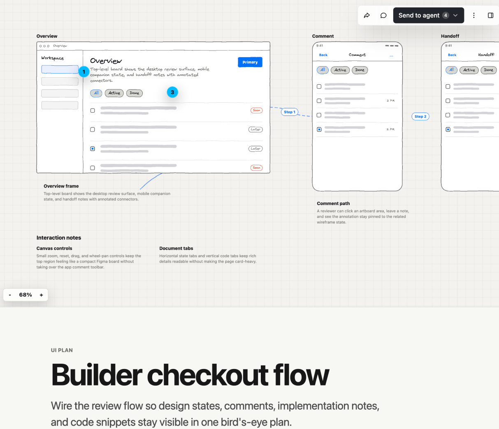

# Skills for coding agents

Small, composable skills for coding agents.

These skills are for teams that want the agent to stay sharp where judgment
matters: orchestration, review, planning, validation, docs discipline, and clear
communication. They are not a giant process framework. Install the pieces you
want, adapt them to your project, and let the model keep room to think.

### Quick install all skills

```sh
npx @agent-native/skills@latest add
```

See the [full CLI docs below](#install).

## Skills

### [`/visual-plan`](skills/visual-plan/README.md)

Turn ordinary text plans into rich interactive visual plans with diagrams, file
maps, annotated code, open questions, and UI/prototype review when useful.

Solves for plans that are too important to bury in chat. The output is
scannable, commentable, and intuitive enough for a human to approve before code
changes start.

<picture>
  
</picture>

Visual plans are MDX, customizable with your own components, and are viewed with the [Agent-Native plans app](https://www.agent-native.com/docs/template-plan). [Source here](https://github.com/BuilderIO/agent-native/)

### [`/visual-recap`](skills/visual-recap/README.md)

Turn a branch, commit, or PR diff into an interactive visual recap with
annotated diffs, diagrams, API/schema summaries, file maps, UI state summaries,
and focused review notes.

Solves for diffs that hide the shape of the change. Reviewers can understand
contracts, architecture moves, schema changes, and UI impact before diving into
raw line-by-line review.

<picture>
  
</picture>

Visual recaps are MDX, customizable with your own components, and are viewed with the [Agent-Native plans app](https://www.agent-native.com/docs/template-plan). [Source here](https://github.com/BuilderIO/agent-native/)

You can also install a GitHub action for these to be automatically generated for every PR with

```sh
npx @agent-native/skills@latest add
```


### [`/efficient-fable`](skills/efficient-fable/README.md)

Use Claude Fable as the orchestrator, architect, synthesizer, and final judge
while lighter agents handle token-heavy research, coding, testing, and log
reduction.

Solves for expensive-model waste: Fable should spend tokens on judgment, not on
reading every file, reducing every log, or manually running every browser check.

<picture>
  <source media="(prefers-color-scheme: dark)" srcset="skills/efficient-fable/assets/fable-orchestrator-dark.png">
  <source media="(prefers-color-scheme: light)" srcset="skills/efficient-fable/assets/fable-orchestrator.png">
  
</picture>

### [`/efficient-frontier`](skills/efficient-frontier/README.md)

Apply the same orchestration as `/efficient-fable` to any high-cost frontier
model: preserve the expensive model for planning, tradeoffs, integration,
validation strategy, and final review; use cheaper agents for bounded heavy
lifting.

Solves for broad work that can be parallelized without asking the most expensive
model to do every scan and every edit itself.

### [`/stay-within-limits`](skills/stay-within-limits/README.md)

Check current 5-hour and weekly usage before substantial work and between
parallel waves, then pause new execution at 95% until the active window is clear
enough to continue.

Solves for long-running agent sessions that accidentally exhaust the current
budget window mid-task instead of pausing cleanly and resuming with a
self-contained plan.

### [`/quick-recap`](skills/quick-recap/README.md)

Add a concise final status block convention so every completed response ends
with a clear green, yellow, or red work-state signal.

Solves for ambiguity at the end of agent work: done, pending a specific
non-routine step, or blocked on the user.

Example green status:

```md
🟢 Updated quick recap docs with output examples
```

Example yellow status:

```md
🟡 Code updated, set PROVIDER_WEBHOOK_SECRET before testing webhooks
```

### [`/read-the-damn-docs`](skills/read-the-damn-docs/README.md)

Make agents web-search for authoritative docs before they guess from stale model
memory.

Solves for version drift and API folklore: package installs, framework config,
SDK imports, provider limits, auth, security, billing, data, migrations, deploys,
and repo-specific contracts all require a docs pass before implementation. For
external APIs and current product behavior, web search for official docs is
usually the first move.

## Install

Run the installer:

```sh
npx @agent-native/skills@latest add
```

The installer walks you through the choices:

- Which skills to install.
- Where visual plans and recaps should live: hosted shareable links
  (recommended), local files only, or a self-hosted/custom Plan app.
- Agent Skills / Codex, Claude Code, or both.
- User-level or project-level install.
- Whether to add managed `AGENTS.md` / `CLAUDE.md` instruction blocks when the
  selected skills have always-on guidance.
- Whether to add the PR Visual Recap GitHub Action when `/visual-recap` is
  selected.

Skip the picker with `--skill`:

```sh
npx @agent-native/skills@latest add --skill quick-recap
npx @agent-native/skills@latest add --skill visual-recap --with-github-action
```

You can also use Vercel's `skills` CLI for a plain skill-folder copy:

```sh
npx skills@latest add BuilderIO/skills --skill quick-recap
```

That installer is useful for quick copying, but it does not add the managed
`AGENTS.md` / `CLAUDE.md` instruction blocks or the PR Visual Recap GitHub
Action that pair well with these skills.
